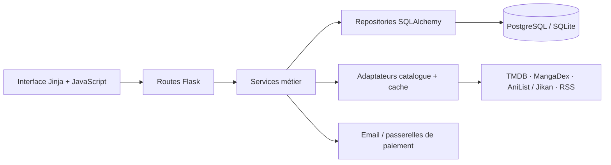

<div align="center">

# TrackMyStart

**Films, séries, mangas — suivre ce qui vous intéresse, retrouver quoi découvrir.**

[Voir le site](https://trackmystart.de) · [Fonctionnalités](#ce-que-fait-trackmystart) · [Lancer le projet](#lancer-le-projet) · [English](#english)


</div>


## Pourquoi ce projet ?

Les nouveautés, les acteurs suivis et les articles sont dispersés entre plusieurs services. TrackMyStart les rassemble dans un espace personnel : découvrir des titres, garder une liste, suivre des acteurs et lire les actualités qui leur sont liées.

Le projet couvre un parcours complet, de la découverte publique au compte utilisateur, avec des préférences persistantes, des droits Gratuit/Premium et une préinscription Premium. Il ne diffuse pas de films ou d’épisodes : les fiches orientent vers les services et les sources concernés.

## Ce que fait TrackMyStart

| Parcours | Fonctionnalités présentes dans le code |
| --- | --- |
| Découvrir | Catalogues films, séries et mangas, recherche, fiches et nouveautés. |
| Suivre | Acteurs favoris, liste personnelle, titres vus ou écartés. |
| Personnaliser | Rubriques, filtres, densité d’affichage et fil de recommandations avec avis explicites. |
| Lire | Actualités éditoriales et extraits RSS avec lien vers la source. |
| Gérer son compte | Inscription, connexion, vérification email, récupération du mot de passe et préférences. |
| Préparer Premium | Consentement de préinscription révocable ; aucun prélèvement à l’inscription. |
| Exploiter | Tests, image Docker, contrôle de santé et scripts de migration/déploiement. |

Les recommandations reposent sur des règles explicables : suivis, liste, sujets et retours de l’utilisateur. Ce n’est pas un modèle d’IA entraîné sur les visiteurs.

## Conception et réalisation

Projet conçu et piloté par **[Mr-yums](https://github.com/Mr-yums)** : définition du produit, parcours utilisateur, règles métier, intégrations et itérations. Le développement s’appuie sur des outils d’IA, avec revue du code et vérifications automatisées.

Ce projet illustre la réalisation d’une application complète : interface, services métier, persistance, API externes, gestion des accès et livraison testée.

## Architecture



- **Backend :** Python, Flask, SQLAlchemy, services métier séparés des routes et des accès SQL.
- **Interface :** Jinja, CSS et modules JavaScript, sans chaîne de compilation front obligatoire.
- **Données :** PostgreSQL en exploitation ; SQLite pour démarrer localement.
- **Livraison :** Docker et GitHub Actions ; tests de migration, droits et écritures concurrentes.

Le nom historique du paquet Python, `yumnews`, est conservé dans les imports.

## Lancer le projet

Prérequis : Python **3.12 ou supérieur**. Node 22 est utilisé pour les contrôles JavaScript.

```bash
python -m venv .venv
.venv/bin/python -m pip install -r requirements.lock
cp .env.example .env
mkdir -p instance
.venv/bin/python -c "import secrets; print(secrets.token_hex(32))"
```

Renseigner la valeur générée dans `SECRET_KEY` du fichier `.env`. Ajouter sa propre `TMDB_API_KEY` pour le catalogue TMDB. Les autres identifiants sont facultatifs pour démarrer ; sans SMTP, les courriers sont simulés et ne sont pas délivrés.

```bash
scripts/trackmystart init
scripts/trackmystart run
```

Ouvrir **http://127.0.0.1:8800**. Le lanceur public écoute uniquement sur cette machine et n’active pas le débogueur. `.env`, `.venv`, bases, journaux et clés privées sont exclus du dépôt.

## Vérifications

```bash
scripts/trackmystart test
node --experimental-vm-modules --test tests/js/*.test.cjs
```

Le workflow GitHub construit l’image, exécute les tests sans réseau et vérifie migrations et concurrence avec une base PostgreSQL isolée. Le test de paiement réel n’est pas exécuté automatiquement. Les comptes, mots de passe et identifiants présents dans les fixtures sont synthétiques.

## État et limites

Cette distribution publique est un instantané nettoyé du projet, avec un historique neuf. Elle ne contient ni identifiants d’exploitation, ni environnement virtuel, ni données de membres, ni raccordement au coffre local. La capture montre la version du site en ligne à la date indiquée ; certaines évolutions du code peuvent ne pas encore y être déployées.

**Les paiements sont désactivés par défaut.** Les intégrations Square/NOWPayments et les coupons sont présents, mais la reprise d’un débit Square interrompu doit être renforcée avant ouverture commerciale. Les quotas spécifiques aux emails de récupération/vérification restent à compléter. Les scripts serveur sont des exemples d’exploitation à adapter, pas une installation automatique prête pour un autre hébergeur.

La présence du code d’intégration ne fournit pas de compte fournisseur ni de garantie de disponibilité des API. Les images et contenus de catalogue restent ceux de leurs sources.

## English

**TrackMyStart is a personal discovery platform for movies, TV series and manga.** It combines catalogue browsing, actor follows, watchlists, explicit recommendation feedback and sourced entertainment news.

Designed and led by **Mr-yums**, with AI-assisted development and automated verification. The stack uses Flask, SQLAlchemy, PostgreSQL/SQLite, Jinja and vanilla JavaScript.

This public repository contains a cleaned source snapshot, with no production credentials or user data. Premium currently uses a reversible waiting-list opt-in; payments are disabled by default. Payment recovery and email abuse controls still need work before commercial activation. See the French setup instructions above and the GitHub Actions workflow for validation.

<!-- [Sol] Présentation de la distribution publique, sans archives de travail. -->
